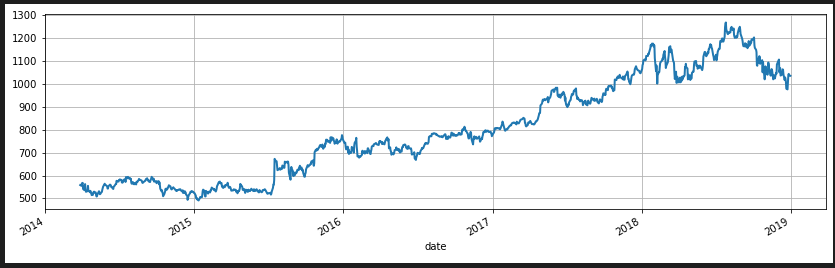
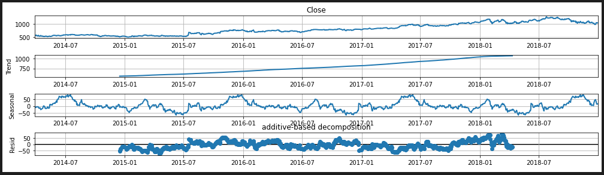
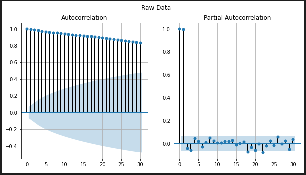
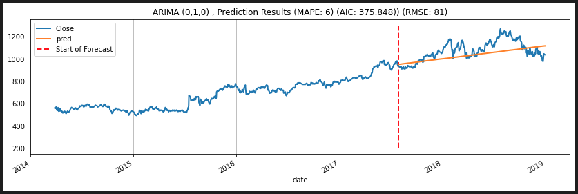

# ARIMA-stock-price

### Purpose
To Forecast stock price of Google with ARIMA model

### Data

* Source: Yahoo Finance (https://finance.yahoo.com/)
* Data: Google Stock Price from 2014-03-01 to 2018-12-31 (collected per date)
* How to Collect: use *FinanceDataReader*

### Mainly Used Library

* statsmodels
* pmdarima
* sklearn

### How to select best ARIMA model

Getting to know about data must be preceded before choosing ARIMA model.

After that, Data should be transformed as an appropriate input to ARIMA. 

With transformed data, now we can find the best ARIMA model.

This is brief overview of process to build ARIMA, check more details in ARIMA.ipynb file.

 

1. Decomposition (Additive / Multiplicative)

- Trend
Closing price is continuously increasing overtime. 

- Seasonal
In setting period as 365, it seems like plot shows weak seaonsal period. Additional verfication is needed to clarify that given data has seasonality. 

- Residual
Residual shows sine graph when analyzed with additive way. However, in case of multiplicative decomposition, residual value is almost 1. This implies data migth violate assumption of independence. 

 

2. Dubrin-Watson Test
This statistic test is used to check whether the residual of data is independent or not.

> result of durbin-watson: 0.000216
> [Conclusion] Residual does violate assumption of independence.

 

3. Check Stationary

  * Graphical Method: Check Auto Correlation Function (ACF) and partial Auto Correlation Function (pACF) 

  

  > ACF: the value decreases slowly
  > 
  > pACF: cut off at lag 1 and after that, the value close to 0 shows negative pACF
  > 
  > [Conclusion] Data has non-stationary property.

 

  * Statistical Method: Dickey Fuller Test

  > result of dickey-fuller: -0.8348 
  > 
  > p-value: 0.80
  > 
  > [Conclusion] Data has non-stationary property.

  Result of two methods shows that differentiation on data is needed.

 

4. Differencing Data

With first differentiation on data, data is transformed to be stationary.
(Data Stationarity has been checked both by graphical and statistical method.)

 

5. Select Initial ARIMA model to check first

According to ACF and pACF, ARIMA(0,1,0) has been selected.

 

6. Parameter Optimization

Find the best ARIMA model with *auto_arima*

 

7. Forecast the stock closing price

